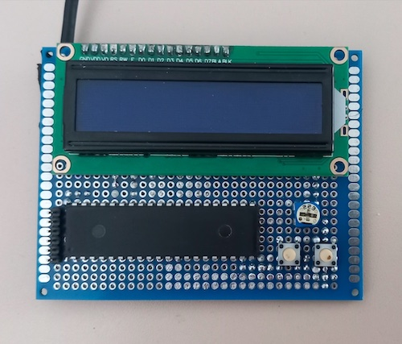
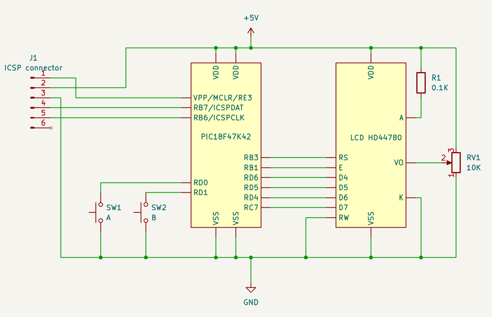

# LastWord

**A standalone, 100% auditable BIP-39 checksum assistant for entropy you generate yourself.**

LastWord is not a random number generator and it does not create entropy for you. It helps you compute the checksum (colloquially associated with the last wor) of the BIP-39 mnemonic you want to build.

**You provide the entropy as coin flips or dice rolls. LastWord completes the mnemonic.**

**The mnemonic building process is designed to be auditable by you, step by step.** While you enter coin flips or dice rolls, LastWord shows the current BIP-39 word being assembled and the 11-bit group behind it. When 11 bits are complete, LastWord shows their decimal value and the corresponding BIP-39 word. You can independently double-check the result against any standard BIP-39 wordlist. **The wordlist can be a PDF of a text file opened on your computer, it doesn't have to be a printed copy**.

When the final entropy bits have been entered, LastWord computes SHA-256, extracts the required checksum bits and displays the completed final word. SHA-256 is the only part of the process that is not practical to perform by hand, so that calculation is delegated to the device. **The checksum either produces a valid seed phrase or not, so it doesn't require any trust.**

LastWord never needs to be trusted to create randomness, because it never generates any. Also, the checksum can also be independently verified later by any standard BIP-39 hardware wallet.



The hardware is intentionally simple: a PIC18F47K42 microcontroller, a 2×16 character LCD and two push buttons. No USB, no networking and no persistent storage.

The prototype shown above is built on perfboard.

## Why not use an ordinary hardware wallet that supports user-supplied entropy?

Because even if a hardware wallet lets you enter your own coin flips or dice rolls to build a BIP-39 mnemonic, you still have to trust that the device is mapping your entropy bits to the correct BIP-39 words.

In other words, you can control the entropy source, but you usually cannot independently verify the entropy-to-word conversion step by step while it happens.

LastWord is designed to make that process auditable: it shows the 11-bit groups, their decimal values and the corresponding BIP-39 words as you enter the entropy.

------------------------------------------------------------------------

## Features

-   Offline operation
-   BIP-39 12-word, 18-word and 24-word mnemonics
-   Coin flip input
-   Von Neumann debiasing
-   Dice roll input
-   PC emulator for development
-   100% auditable BIP-39 word selection

------------------------------------------------------------------------

## Hardware

Current target:

-   Microchip PIC18F47K42
-   HD44780-compatible 2×16 LCD
-   Two push buttons



------------------------------------------------------------------------

## Building

### PC emulator

```sh
./build_emulator.sh
./bin/lastword
```

### PIC firmware

```sh
./build_pic18.sh
```

The generated firmware image is:

```text
lastword.hex
```

------------------------------------------------------------------------

## Project layout

```text
firmware/   Firmware source code
hardware/   Schematics and PCB files
images/     Prototype and hardware images
scripts/    Utility scripts
```

------------------------------------------------------------------------

## Using the device

LastWord is operated using two buttons and a 2×16 character LCD.

The meaning of the buttons depends on the current screen. In menus:

- **Button A**: select / confirm
- **Button B**: next option

During entropy input, the LCD always follows the same basic layout:

```text
+----------------+
|W07 10110______ |
|<input controls>|
+----------------+
```

The first line shows the BIP-39 word currently being assembled and its entropy bits.

The second line shows the controls or the current state of the selected entropy input method.

When an 11-bit group is complete, LastWord pauses and displays the corresponding BIP-39 word:

```text
+----------------+
|W07 10110100101 |
|1445 security   |
+----------------+
```

The first line is the exact 11-bit value used as the BIP-39 word index.

The second line shows:

```text
decimal index + BIP-39 word
```

Press either button to continue to the next word.

### Main menu

After startup, the main menu provides:

1. **Entropy Input**
2. **Self Test**
3. **About**

### Entropy Input

Select **Entropy Input** to process entropy generated by you and convert it into its BIP-39 representation.

LastWord does **not** generate the entropy.

First select the desired mnemonic length:

```text
+----------------+
|12 WORDS        |
|A=OK  B=NEXT    |
+----------------+
```

The supported lengths are:

| Words | Entropy | Checksum |
|---:|---:|---:|
| 12 | 128 bits | 4 bits |
| 18 | 192 bits | 6 bits |
| 24 | 256 bits | 8 bits |

Press **B** to cycle through the available lengths and **A** to confirm.

Then select the entropy input method:

1. **Coin Flips**
2. **Von Neumann Coin**
3. **Dice Rolls**

---

### Coin Flips

Use a physical coin to generate each entropy bit.

```text
Heads -> 0
Tails -> 1
```

During input:

```text
+----------------+
|W07 10110______ |
|A:H=0 B:T=1     |
+----------------+
```

Press:

- **A** for Heads (`0`)
- **B** for Tails (`1`)

Each button press immediately adds one bit supplied by the physical coin flip.

As soon as 11 bits have been collected, LastWord displays their decimal BIP-39 index and the corresponding word:

```text
+----------------+
|W07 10110100101 |
|1445 security   |
+----------------+
```

Press either button after checking the result to continue.

---

### Von Neumann Coin

Von Neumann's method processes coin flips in pairs. Under the usual assumption that successive flips are independent and have the same bias, equal pairs are discarded while different pairs produce an unbiased bit. This allows an ordinary, slightly biased coin to be used without assuming a perfect 50/50 coin.

See: [Fair coin — Von Neumann extractor](https://en.wikipedia.org/wiki/Fair_coin)

LastWord applies the following deterministic mapping:

```text
HH -> discard
HT -> 0
TH -> 1
TT -> discard
```

The coin remains the source of randomness. LastWord only applies the extraction rule.

At the beginning of a pair:

```text
+----------------+
|W07 10110______ |
|VN1 A:H B:T     |
+----------------+
```

After the first flip, LastWord waits for the second one. For example, after Heads:

```text
+----------------+
|W07 10110______ |
|VN2 H? A:H B:T  |
+----------------+
```

After the second flip, the result is briefly displayed.

For an accepted pair:

```text
+----------------+
|W07 101100_____ |
|HT -> 0         |
+----------------+
```

or:

```text
+----------------+
|W07 101101_____ |
|TH -> 1         |
+----------------+
```

For an equal pair:

```text
+----------------+
|W07 10110______ |
|HH -> DISCARD   |
+----------------+
```

or:

```text
+----------------+
|W07 10110______ |
|TT -> DISCARD   |
+----------------+
```

Discarded pairs do not add entropy bits.

The process continues until the required entropy length has been reached.

---

### Dice Rolls

Use a physical six-sided die and enter each result into LastWord.

For each roll, use **B** to select the number and **A** to confirm it:

```text
+----------------+
|W07 10110______ |
|D:4 A:OK B:+    |
+----------------+
```

LastWord uses the following mapping:

```text
1 -> 00
2 -> 01
3 -> 10
4 -> 11
5 -> discard
6 -> discard
```

After confirming an accepted roll, the resulting bits are briefly displayed:

```text
+----------------+
|W07 1011011____ |
|D4 -> 11        |
+----------------+
```

Rolls of `5` and `6` are discarded:

```text
+----------------+
|W07 10110______ |
|D5 -> DISCARD   |
+----------------+
```

A single die roll is never allowed to contribute to two different BIP-39 words.

If only one bit is required to complete the current 11-bit group, LastWord uses the **first bit** of the dice mapping and discards the second.

For example, if only one bit is missing:

```text
4 -> 11
```

only the first `1` is used:

```text
+----------------+
|W07 10110100101 |
|D4 -> 1 DROP    |
+----------------+
```

The next BIP-39 word starts from a new physical dice roll.

---

### The final word

The last BIP-39 word is different from all previous words.

It contains both:

- entropy supplied by the user;
- checksum bits calculated from SHA-256.

The exact split depends on the selected mnemonic length:

```text
12 words: EEEEEEE|CCCC
18 words: EEEEE|CCCCCC
24 words: EEE|CCCCCCCC
```

where:

```text
E = entropy bit supplied by the user
C = checksum bit calculated by LastWord
```

While the remaining entropy bits are being entered, the checksum portion is left blank.

For a 24-word mnemonic:

```text
+----------------+
|W24 10_|________|
|A:H=0 B:T=1     |
+----------------+
```

After all entropy has been entered, LastWord computes SHA-256 and fills in the checksum bits:

```text
+----------------+
|W24 101|01100110|
|1382 <word>     |
+----------------+
```

The `|` character explicitly separates the entropy portion from the checksum portion.

For the supported mnemonic lengths, the final word is displayed as:

```text
12 words
+----------------+
|W12 EEEEEEE|CCCC|
|index word      |
+----------------+

18 words
+----------------+
|W18 EEEEE|CCCCCC|
|index word      |
+----------------+

24 words
+----------------+
|W24 EEE|CCCCCCCC|
|index word      |
+----------------+
```

This is the only BIP-39 word whose 11-bit index is not determined entirely by the entropy entered by the user.

---

### Mnemonic review

After the checksum has been calculated and the final word completed, LastWord allows the resulting BIP-39 mnemonic to be reviewed word by word.

For example:

```text
+----------------+
|01/24 abandon   |
|A=PREV B=NEXT   |
+----------------+
```

Use:

- **A** to move to the previous word
- **B** to move to the next word

The review screen does not generate or alter any data. It only displays the BIP-39 representation of the entropy already supplied by the user and its checksum.

---

### Self Test

The self-test verifies the firmware's entropy-processing and BIP-39 routines.

```text
+----------------+
|SELF TEST: OK   |
|                |
+----------------+
```

Press either button to return to the main menu.

A self-test is also performed automatically during startup.

---

### About

The About screen displays the project name and firmware version:

```text
+----------------+
|LASTWORD        |
|VER v1.0        |
+----------------+
```

Press either button to return to the main menu.

------------------------------------------------------------------------

## License

Released under the MIT License.

See the `LICENSE` file for details.
